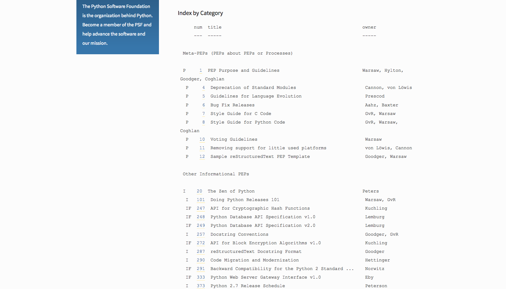

### Pyhtonの特徴と
### 注目ライブラリのご紹介

< OSS X Users Meeting > #19 Python

Takanori Suzuki / 2017-06-29
---

### Who am I?(お前誰よ)

* 鈴木たかのり / Takanori Suzuki
* Twitter: @takanory
* 株式会社ビープラウド
* 一般社団法人PyCon JP 理事
* Pythonボルダリング部(#kabepy)部長

---

### 今日話すこと

* Pythonとは
* Pythonの特徴
* 注目ライブラリ
* Pythonを学ぶには

---

### 最初に質問

---

### Python知ってる人?

---

### Python書いたことある人?

---

### 他のプログラミング言語は知ってる人?

---

### Pythonとは

---

### Pythonとは

* マルチプラットフォーム
* マルチパラダイム
* Python 3
* 豊富なライブラリ

---

### マルチプラットフォーム

* Windows
* macOS
* Linux
* 他

---

### マルチパラダイム

* オブジェクト指向
* 命令形
* 手続き型
* 関数型

---

### Python 3

* 今から使うならPython 3一択
* 最新バージョンは 3.6.1
* 日本語の文字コードに悩まされにくい

```python
print('こんにちは世界!') # Python 3系
print 'こんにちは世界!' # Python 2系
```

---

### 豊富なライブラリ

* 400弱の標準ライブラリ
* https://docs.python.jp/3/library/index.html


---

### 豊富なサードパーティ製パッケージ

* 多数のパッケージ
* https://pypi.python.org/pypi


---

### Python の特徴

---

### Python の特徴

* 読みやすいコード
* PEP8: コーディングスタイル
* PEP: 拡張提案
* Pythonでできること

---

### 読みやすいコード

* 構造(ブロック)をインデントで表現

```python
for num in range(1,101):
    if num % 15 == 0:
        print('Fizz Buzz')
    elif num % 3 == 0:
        print('Fizz')
    elif num % 5 == 0:
        print('Buzz')
    else:
        print(num)
```

---

### PEP8: コーディングスタイル

* PEP 8: Style Guide for Python Code
* https://www.python.org/dev/peps/pep-0008/
* OK: `spam(ham[1], {eggs: 2})`
* NG: `spam( ham[ 1 ], { eggs: 2 } )`
* OK: `dct['key'] = lst[index]`
* NG: `dct ['key'] = lst [index]`

---

### PEP8: コーディングスタイル

* PEP8を守るためのツール
* pycodestyle: コーディングスタイルのチェックツール
* autopep8: 自動的に書き換えるツール
* flake8: pycodestyle + 論理チェックツール

---

### PEP: Pythonの拡張提案

* Python Enhancement Proposal
* https://www.python.org/dev/peps/



---

### Pythonでできること
